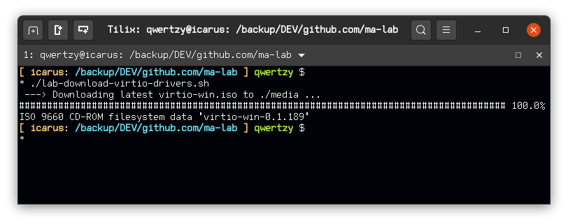
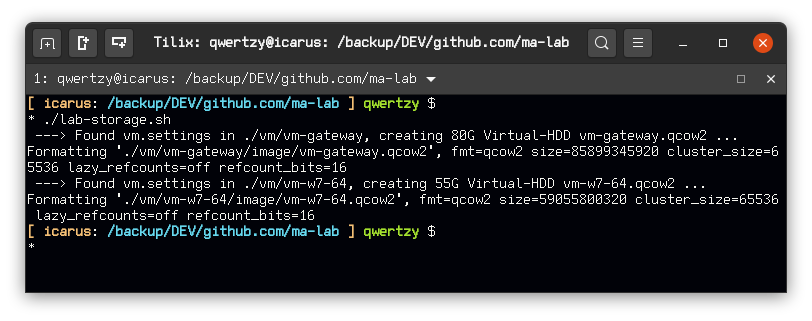

# ma-lab
Lab using KVM and QEMU

**VMs**
- Gateway VM: Ubuntu 20.04 Server
- Analysis: Windows 7 64 (GSP1RMCPRXFRER_EN_DVD)

**Scripts**
- `lab-download-virtio-drivers.sh` : Downloads the latest available Windows virtio drivers to be able to automate Windows guests installation

- `lab-network.sh` : Manages the lab network (bridges and states), definition XML files inside network directory

- `lab-storage.sh` : Creates VM Hard Disk files, by default looks under directory vm for HDDs to build, specifically for a vm.settings file containing build variables

**TODO**
- Add lab logical diagram
- Set network iptables rules
- Guest Lab VM image creation
- Guest installation
- Guest setup
- Guest configuration
- Guest Analysis VM pafish check