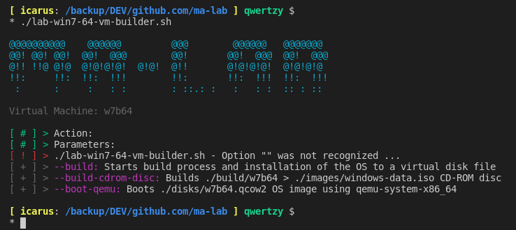
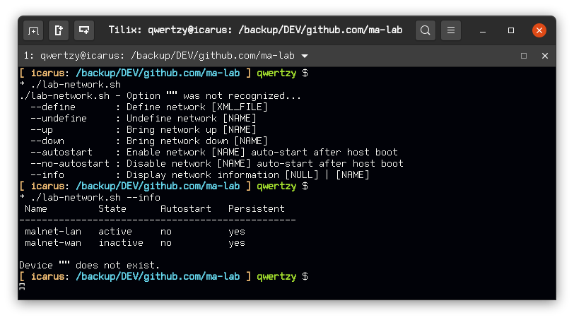
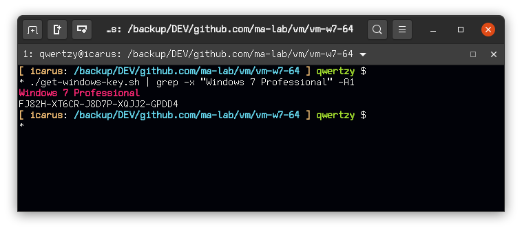

Collection of bash scripts to automate the installation of an Operating System on a virtual hard disk. The objective is to reduce the time necessary to setup a base lab.

**VMs**
- Analysis machine: Windows 7 64 Bit (tested with GSP1RMCPRXFRER_EN_DVD iso)
- Gateway machine: Ubuntu 20.04 Server 64 Bit

**Dependencies**
- KVM (Ubuntu `sudo apt install -y qemu qemu-kvm libvirt-daemon libvirt-clients bridge-utils virt-manager`)
- p7zip (Ubuntu `sudo apt install -y p7zip`) 
- mkisofs
- curl
- bash

**Usage**
1. Setting up the network:
    - WAN network:
        - `lab-network.sh --define network-malnet-nat.xml` (only needed once)
        - `lab-network.sh --autostart network-malnet-nat.xml`
        - `lab-network.sh --up network-malnet-nat.xml` (if autostart is not set, then this script needs to be run after every host reboot)

    - LAN network:
        - `lab-network.sh --define network-malnet-internal.xml` (only needed once)
        - `lab-network.sh --autostart network-malnet-internal.xml`
        - `lab-network.sh --up network-malnet-internal.xml` (if autostart is not set, then this script needs to be run after every host reboot)

2. Place a copy of a Windows 7 64 Bit and Ubuntu 20.04 Server 64 Bit ISO file in `images` directory

3. Edit script files:

    - Gateway - NOTE: username: gateway, password: ubuntu DOES NOT WORK!!! instead had to hardcode root user's password as ubuntu, after login add a user `adduser gateway` and change root password!!!
        - `lab-gateway-vm-builder.sh` file:
            - VM_OS_ISO variable points to Ubuntu ISO file
            - Customize VM_NAME, VM_DISK_SIZE, VM_DISK_TYPE variables
        - Optional steps:
            - Edit VM configuration `user-data` file, and set the username and password (default username: gateway, password: ubuntu DOES NOT WORK!) `echo YOUR_PASSWORD | mkpasswd -m sha512crypt --stdin`
            - Any files inside `tools` directory will be included in the ISO build and accessible from within the guest.
    - Analysis:
        - `lab-win7-64-vm-builder.sh` file:
            - VM_WINDOWS_ISO variable points to Windows ISO file
            - Customize VM_NAME, VM_DISK_SIZE, VM_DISK_TYPE variables
        - Optional steps:
            - Edit VM configuration files `autounattend.xml` (drives the installation: web gui here https://www.windowsafg.com/) and `vm-setup.ps1` (executed post installation) to suit your needs
            - Any files inside `tools` directory will be included in the ISO build and copied over to the desktop.

4. Execute `lab-win7-64-vm-builder.sh --build` or `lab-gateway-vm-builder.sh --build` according to the OS you want to bootstrap

5. Perform OS installation:
    - KVM:
        - Gateway: `lab-gateway-vm-builder.sh --boot-kvm`
        - Analysis: `lab-win7-64-vm-builder.sh --boot-kvm`
    - QEMU:
        - Gateway: `lab-gateway-vm-builder.sh --boot-qemu`
        - Analysis: `lab-win7-64-vm-builder.sh --boot-qemu`

**Script description**
- `lab-win7-64-vm-builder.sh` : Sets environment, downloads, build ISOs and executes QEMU to install the target OS on a virtual hard disk file.

- `lab-network.sh` : Manages the lab network (bridges and states), definition XML files inside network directory. 
    - *`network-malnet-nat.xml`* : NAT network (name is malnet-wan, address='192.168.200.1', netmask='255.255.255.0', dhcp range start='192.168.200.2' end='192.168.200.254')
    - *`network-malnet-internal.xml`* : Private internal network (name is malnet-internal, mac address='B4:2E:99:3D:A8:43')

- `get-windows-key.sh` : Scrapes Microsoft Windows https://docs.microsoft.com/en-us/windows-server/get-started/kmsclientkeys page for Windows Serial Keys and displays them in the terminal. **Serials provided by Microsoft**.

