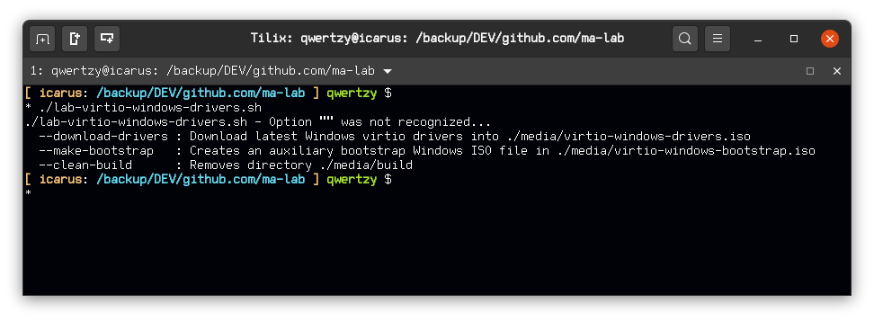
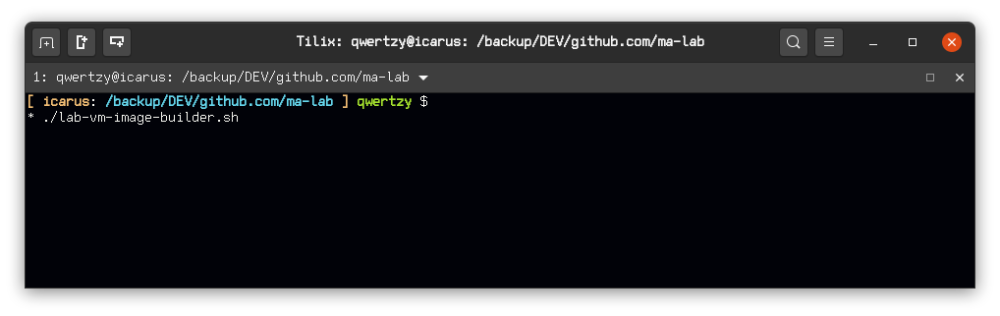

# ma-lab
Lab using KVM and QEMU

**VMs**
- Gateway VM: Ubuntu 20.04 Server
- Analysis: Windows 7 64 (GSP1RMCPRXFRER_EN_DVD)

**Usage**
1. Network NAT interface
- `lab-network.sh --define network-malnet-nat.xml` 
- `lab-network.sh --autostart network-malnet-nat.xml`
- `lab-network.sh --up network-malnet-nat.xml`

2. Create the Virtual Hard disks
- `lab-storage.sh` (2 HDDs, but it's only a few Kbs)
3. If Windows 7, pull Virtio Drivers
- `lab-virtio-windows-drivers.sh --download-drivers`
- `lab-virtio-windows-drivers.sh --make-bootstrap`
4. Install
- `lab-vm-image-builder.sh`

**Scripts**
- `lab-virtio-windows-drivers.sh` : Downloads Windows virtio drivers (Some versions of Windows (7 64 Bits) needs drivers or won't detect the Hard Disk and will fail installation) and creates an auxiliary ISO file to be able to automate Windows guests installation. This script uses a file `autounattend.xml` which holds information for unnatended (automated) Windows installations without user interaction. You can use https://www.windowsafg.com/ website to create yours other Windows versions are supported -- you then have to manualy edit the file and add the necessary `<DriverPaths>` values to point Windows during installation to the auxiliary CD containing the drivers. The process currently is fully automated for Windows 7 64 (GSP1RMCPRXFRER_EN_DVD).

- `lab-network.sh` : Manages the lab network (bridges and states), definition XML files inside network directory. 
- *`network-malnet-nat.xml`* : NAT network (name is malnet-wan, address='192.168.200.1', netmask='255.255.255.0', dhcp range start='192.168.200.2' end='192.168.200.254')
- *`network-malnet-internal.xml`* : Private internal network (name is malnet-internal, mac address='B4:2E:99:3D:A8:43')

- `lab-storage.sh` : Creates VM Hard Disk files, by default looks under directory vm for HDDs to build, specifically for a vm.settings file containing build variables. Everytime it's run it will format the HDD files!

- `get-windows-key.sh` : Scrapes Microsoft Windows https://docs.microsoft.com/en-us/windows-server/get-started/kmsclientkeys page for Windows Serial Keys and displays them in the terminal. **Serials provided by Microsoft**.

- `lab-vm-image-builder.sh` : Runs QEMU and installs the OS (Windows 7 64 only at the moment, no input while installing required --- No User name or Password set)

**TODO**
- Add lab logical diagram
- Set network iptables rules
- Guest Lab VM image creation
- Guest installation
- Guest setup
- Guest configuration
- Guest Analysis VM pafish check